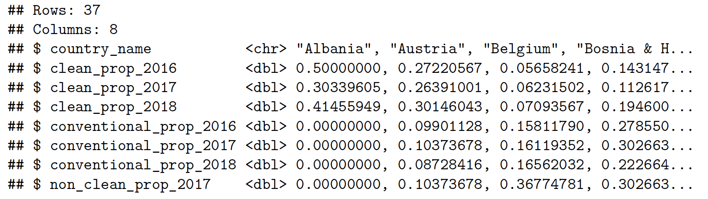
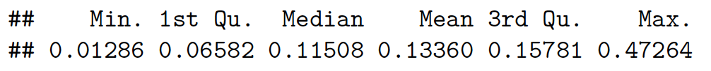
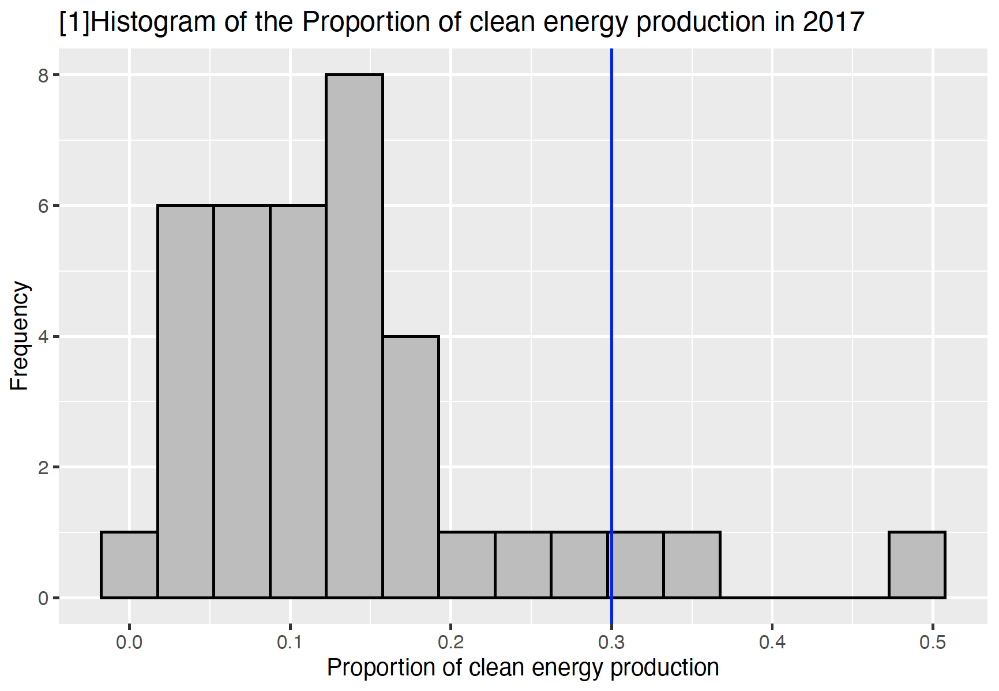
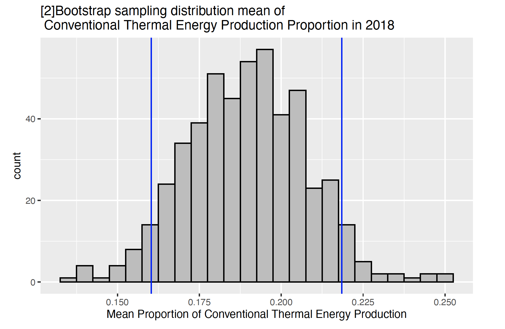
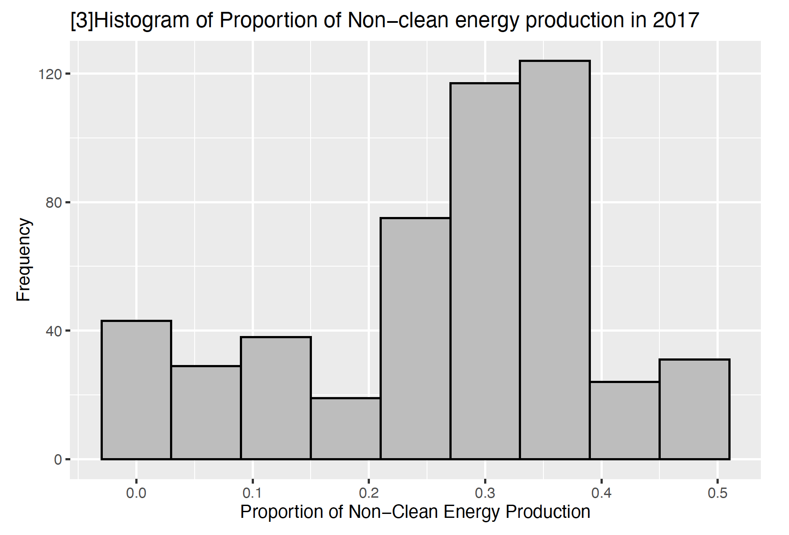
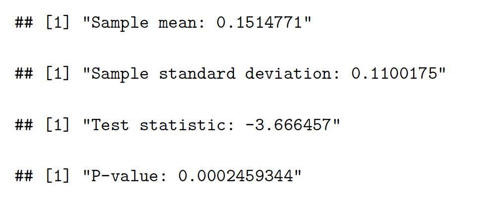
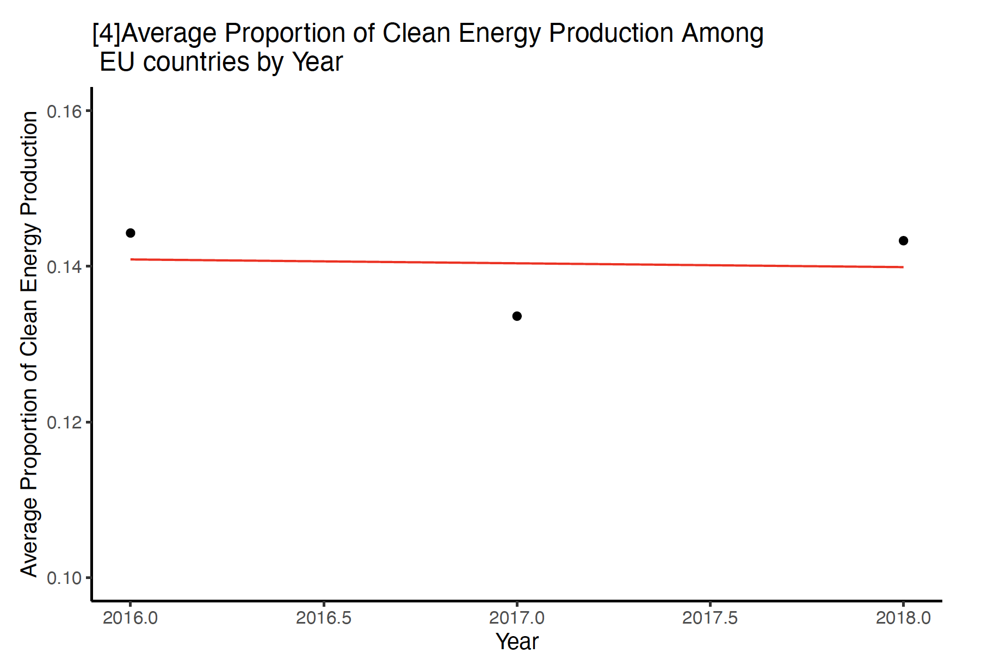
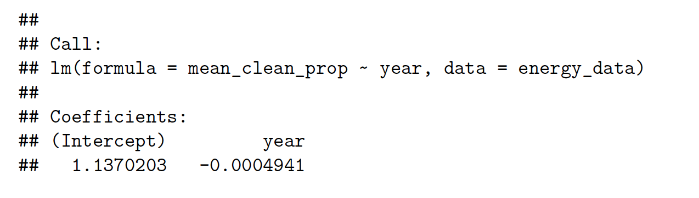
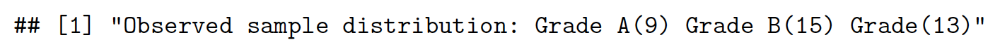
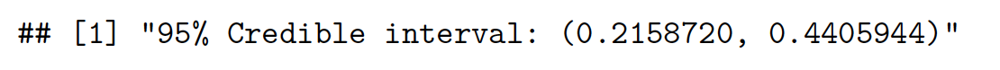

# An Investigation into the EU Power Sector and its Clean Energy Status

## Abstract

This report is an investigation into the European Union Power Section and its Clean Energy Status. The data used for this report is from EuroStat, and it investigated the 2019 statistics annual electricity data from 2016 to 2018 on the volumes of electricity that have been produced and supplied at the level of the European Union. (EuroStat) The data includes information on the annual total energy production of EU nations, as well as amount of annual energy production according to type, such as nuclear energy or solar energy. Our overarching research question is, how are we doing in terms of current progress with regards to renewable energy? Are we on the right track? Several statistical methods such as bootstrap confidence intervals, maximum likelihood estimation, hypothesis tests, simple linear regression, goodness of fit tests, and bayesian credible intervals were used to investigate research questions such as, what is average proportion of annual non-clean energy production in the EU in 2017, what is the estimated proportion of EU countries in 2018 that
have met their renewable energy production targets, and etc. The overarching finding was that clean renewable energy production integration is going very well and has progressed in the European Union. With specific findings such as, with 95% probability, the true proportion of EU countries that have met their target in 2018 is between 0.21 and 0.44 based on prior information. While the report does face some weaknesses and difficulty due to the lack of data points in the simple linear regression analysis, this has been suggested for future studies. Overall we were able to conclude that, results were very promising, and there is great hope that the European Union will continue to meet their target proportion of clean energy production in the coming years.

## Introduction

It is fair to assume that the most recent generation is the most aware of the issues of climate change, and
the most knowledgeable about the importance of sustainable living. The need to halt climate change and
promote sustainable living is the largest goal and problem our society faces today. In this report, we will
be investigating the power sector of the European Union and its status in its increase in renewable energy
production.

The data used for this report is from EuroStat, and it investigated the 2019 statistics annual electricity data
from 2016 to 2018 on the volumes of electricity that have been produced and supplied at the level of the
European Union. (EuroStat) The data includes information on the annual total energy production of EU
nations, as well as amount of annual energy production according to type, such as nuclear energy or solar
energy.

Increasing the amount of renewable energy production is a very effective way to reduce carbon emissions and
make way for sustainable living. This goal of increasing the use of renewable energy has been reflect multinationally
in the form of renewable energy production proportion targets. Governments across the globe have
been participating in meeting these targets set at these international forums in an effort to work together to halt climate change. An example would be the groups such as the G20, the EU and the Paris Agreement adopted at COP21. In tackling any large-scale issue, it is imperative that progress is assessed accurately
and without bias. Our report today tackles this problem and aims to accurately assess our progress in the
increase in renewable energy production using many statistical methods of analysis. The analysis in this
investigation will be important in setting new renewable energy production targets, judge how well we are
collaborating on the issue of climate change and whether our current efforts are indeed enough.
It is clear to see that such investigation holds global relevance, as the issue is inherently global. It is important
to note that international collaboration is a crucial, as well as most difficult when countries have their own
motives and goals in mind. This investigation will provide evidence on whether changes need to be made in
our fight towards sustainability or whether we are on the right track.

Before we get into the report, here is some important terminology that should be defined beforehand.
Clean renewable energy refers to energy produced by wind, solar, hydro and geothermal energy production
types. Non-clean renewable energy refers to energy produced by nuclear and conventional thermal energy
production types. A population is an entire group that we would like to draw conclusions about. (Bhandari)
A sample is a specific group that we have collected data from. (Bhandari) A confidence interval gives an
estimated range of values that is likely to include an unknown population parameter, the estimated range
being calculated from a given set of sample data. (Easton)

In this investigation we address several research questions and form several hypotheses. Our overarching
research question is, how are we doing in terms of current progress with regards to renewable energy? Are we
on the right track? Does the data align with what government officials claim to be true? Our main hypothesis
to the overarching research questions is that we have not progressed fast or far enough in renewable energy
production. And the claims made by government officials about our progress is questionable as it does not
necessarily align with our data.

Moreover, here are the specific research questions we will be investigating in this report.
1. On average, is the proportion of annual clean energy production increasing over the year 2018 among
the EU nations?
2. On average, what is the proportion of annual conventional thermal energy production across the EU
nations in the years 2016 to 2018?
3. On average, what is the proportion of annual non-clean energy production across the EU nations in
2017?
4. There is a claim by EuroStat that in 2018, the share of renewable energy in the EU is up to 18%.
(EuroStat) Can we trust this claim?
5. It is evident that some countries in the EU are doing better in meeting the renewable energy targets
than others. Suppose we were to grade the EU countries based on their renewable energy production
proportion, what would the distribution of these grades look like?
6. What is the estimated proportion of EU countries in 2018 that have met their renewable energy
production targets?

The next section in this report will describe the data used in this report.

## Data
The data used in this report is from a R package called tidytuesdayR. From tidytuesdayR we will be using
the European Energy Dataset, taken from Eurostat. The dataset includes information on the annual total
energy production in gigawatt hours for 37 nations in the European Union for the years 2016, 2017 and 2018.
It also includes information on the annual energy production in gigawatt hours separated into several energy production types for these same 37 nations for the years 2016, 2017 and 2018. The energy production types
are as follows, conventional thermal (fossil fuels), nuclear, hydro, wind, solar, geothermal, or other.
According to Eurostat, this dataset consists of information voluntarily supplied by the member states of the
European Union. (EuroStat) The data collection process for this report was fairly simple. The tidytuesdayR
package was installed and loaded as a library in R studio, then the European Energy Dataset was loaded in
from the R package.

There was quite an extensive cleaning process involved. Firstly, some minor errors on the country names
were fixed and NA values in the numerical columns were replaced with zeros. The main issue with the
original dataset was that the amount of energy produced was expressed in gigawatts hour. This meant that
when finding the average over countries, it would be impossible to control for the size of the country. So, we
used the proportion of energy production type. We introduced new columns; for example, the proportion
of conventional energy production, and were calculated by dividing the amount of energy produced by a
certain energy type by the total amount of energy produced in gigawatt hour for every country by year. We
also created a new column for clean energy to calculate the annual proportion of clean energy production,
which aggregated the energy production types, wind, solar, geothermal and hydro. The same was also done
for non-clean energy production types which included nuclear and conventional thermal.

We then end up with the dataset below. Here is a glimpse for a better idea.

Here are some of the important variables. The year at the end of the variable names indicate the annual
year the energy production proportion is from. To avoid repetition, the variables will be described without
their year. Nonetheless, it is quite straight forward.

1. country_name : Categorical variable. Character type. Lists of the 37 nations in the European Union.
2. clean_prop : Numerical variable. Numeric type. Is the proportion of clean energy production (hydro,
wind, solar and geothermal) in a country for a certain year.
3. conventional_prop : Numerical variable. Numeric type. Is the proportion of conventional thermal
energy production in a country for a certain year.
4. non_clean_prop : Numerical variable. Numeric type. Is the proportion of non-clean energy production
(nuclear, conventional thermal) in a country for a certain year.

Here is the numerical summary of the proportion of clean energy production for 2017.

We can see that in 2017, the average proportion of clean energy production across the EU nations was 0.13360.
What is more surprising is the spread of the data. The minimum proportion of clean energy production
is 0.01286, which is very very low. The maximum proportion of clean energy production is 0.47264, which
is very very high. This numerical summary shows that the progress of implementing renewable energy
production is very variable across countries. We observe that there are some countries that rely solely on
non-clean means of energy production, and certain countries that use renewable clean energy production
methods for about half of their annual energy production.

Let’s observe the distribution of the proportion of clean energy production for 2017.

The plot above is a histogram of the proportion of clean energy production in 2017. On the x-axis we have
the proportion of clean energy production, and on the y-axis the frequency. The blue line in the graph
indicates the upper quantile, which is 75 percentile quantiles plus (1.5 multiplied by the interquartile range).
Intuitively, it represents the threshold for the upper bound outlier. The lower bound outlier threshold is not
in the plot as no points in the data were lower bound outliers. As we can see in the plot above, there were
three outlier data points in our dataset. Observing the plot and ignoring the outliers, the distribution seems
to be the close to a normal distribution and is not definitively skewed in either direction. This means that
a good parameter of interest will be the mean, rather than the median. This is because when there is no
skewness, the mean is an accurate representation of the middle of the data.
Later in investigation, we will perform a bootstrap on the proportion of conventional thermal energy production
for the years of 2016, 2017 and 2018. The bootstrap will allow us to find the true mean of the
proportion of conventional energy production for these years. We opted for the bootstrap method because
we only have 37 data points in our dataset. This is because there are only 37 countries in the European
Union. By performing a bootstrap, we will be able to increase the number of data points and reach a true
normal distribution of means. This will help us produce a reliable confidence interval for the true proportion
mean.

The next section will describe the methodologies used in the investigation.

## Methods

### Confidence Interval
To answer the research question, on average, what is the proportion of annual conventional thermal energy
production across the EU nations in 2018, we will be using a statistical method called bootstrap confidence
intervals.

The aim of this method is to “make an inference about an estimate (such as sample mean) for a population
parameter (such as population mean) using sample data. It is a resampling method by independently
sampling with replacement from an existing sample data with the same sample size n and performing
inference among these resampled data” (Yen) We will also be using a certain type of bootstrapping method
called empirical bootstrapping, this is because our European Energy Data is empirical data. In our case we
will be randomly selecting 500 samples of the proportion of conventional thermal energy production with
replacement. This will be done for the year 2018. And the mean of each of these 500 samples will make up
the bootstrap sampling distribution. From this we will be able to obtain a confidence interval of 95%. Thus,
we will be able to estimate with 95% confidence that the mean of the proportion of conventional thermal
energy production in 2018 is a value in the range of the outputted confidence interval. This will help us
estimate the true mean of the proportion of conventional thermal energy production, and we will be able to
investigate how much EU countries are reliant on conventional thermal energy production, a non-renewable
energy source.

Our parameter of interest is the mean of the proportion of conventional thermal energy production in 2018.
And we will be bootstrapping over the proportion of conventional thermal energy production numerical
variable. We will be conducting one bootstrap for 2018. The bootstrap will have an iteration of 500 and a
sample size of 37, collected with replacement.

We deemed the bootstrap confidence interval due to its assumptions and practical rationale. The bootstrap
method is a very good choice for our variable and this dataset. This is because our dataset only consists
of 37 data points, due to the fact that the European Union has 37 member states. Our sample dataset
is not normally distributed, but by doing bootstrap sampling our estimate for the confidence interval will
stabilize thanks to the law of large numbers. This means as the number of sample means increases, the
bootstrap distribution will reach a normal distribution, allowing for a better true estimate of the interval of
the proportion of conventional thermal energy production.

There are a couple assumptions that have been made for the bootstrap method. Firstly, the sample data
must be independent and identically distributed. We assume that this is fulfilled as this is an empirical
dataset. There is a possibility of confounding variables between observations, but this is the best we can do for now. Secondly, the sample size should not be too small. This has also been fulfilled as 37 countries is a good enough size for a sample. We have also decided to use a 95% confidence interval, partly because it is very commonly used in statistics and because we are confident in our sample.

### Maximum Likelihood Estimator
To answer the research question, on average, what is the proportion of annual non-clean energy production across the EU nations in 2017, we will be using a statistical method called maximum likelihood estimation.

Intuitively speaking, the aim of maximum likelihood estimation is to estimate a parameter of interest of an observed data distribution. Such as is the case here, we have an observed dataset on the proportion of energy production among the European Union Member states.  

The maximum likelihood estimator is obtained by maximizing the likelihood of the sample. The value that maximizes the likelihood is called the maximum likelihood estimator. Thus, we can obtain the solution through differentiation and find a value of the likelihood function that maximizes it. 

The parameter of interest for this method is the average proportion of non-clean energy production among EU nations in 2017. Our variable of interest is the proportion of non-clean energy production across the EU nations in 2017. When plotting the initial sample, the distribution seems to follow a normal distribution; the plot will appear in the results section. Therefore, we will assume that our empirical data follows a normal distribution and is a sequence that is independent and identically distributed. We also assume that the mean is $\mu$ and fixed variance, $\sigma^2$. We will use the maximum likelihood estimator (MLE) approach to estimate the mean, $\mu$. The MLE of $\mu$ is $\bar{X} = \hat{\mu}$. All derivations regarding the MLE can be found in Section 1 of the Appendix.

From the derivation in our appendix we can determine that maximum likelihood estimators of the mean are, $\hat{\mu} = \frac{1}{n} \sum_{i=1}^n(x_j)$.  

Thus, we can conclude that the maximum likelihood estimator $\hat{\mu}$ is equal to the sample mean.

### Hypothesis Test
To answer the research question, is the claim that in 2018, the share of renewable energy in the EU is up to 18%, a reliable/trustworthy claim, we will be using a statistical method called hypothesis testing.  

Intuitively, hypothesis testing is exactly as it sounds. With hypothesis testing we are able to evaluate the meaningfulness of evidence from the sample, and it helps us make decisions on whether some results happened by chance or are significant. Hypothesis testing is best explained by an example.  

For this research question, the parameter of interest is the average proportion of clean energy production in 2018. Our variable of interest is the proportion of clean energy production in 2018; this is a numeric variable. For this question, we assume that the average proportion of clean energy production across the EU member states is the same as the proportion of clean energy production in the whole EU. Arguments can be made against this assumption, due to varying sizes of EU member states. However, since we do not have a data on the size of each nation in the dataset, the size variable cannot be controlled. Thus, we will assume this statement, as it is the next best option.  

We set up a null hypothesis and an alternative hypothesis. Our null hypothesis is that the average proportion of clean energy production for EU member states in 2018 is 0.18. Our alternative hypothesis is that the average proportion of clean energy production of EU member states in 2018 is not 0.18. We will calculate the test statistic (Z-score) using the sample mean, the sample standard deviation and the sample size. Then calculate the p-value to test whether or not we should reject the null-hypothesis or decide to not reject the null hypothesis.  

Some of the assumptions for a hypothesis test, is that the sample is random, independent and identically distributed. Another is that the sample follows a normal distribution. We deem both as satisfied.  

### Linear Regression
To answer the research question, on average, is the proportion of annual clean energy production increasing over the years of 2016 to 2018 among the EU nations, we will be using a statistical method called simple linear regression.  

A simple linear regression model helps us to capture the relationship between two continuous random variables. The variable on the x-axis is called the predictor variable. The variable on the y-axis is called the response variable. Just like their names, the predictor variable in a way predicts the outcome of the response variable.  

A mathematical representation of the simple linear regression model is as such.  
$Y_i = \beta_0 + \beta_1X_i + e_i$  

$X_i$ is the predictor variable  
$Y_i$ is the response variable  
$\beta_0$ is the intercept  
$\beta_1$ is the coefficient value  
$e_i$ is the error term  

By observing the coefficient term, we can see the statistical relationship between the predictor variable and the response variable.  

In our case our predictor variable is the year (2016 to 2018) and our response variable is the average proportion of annual clean energy production of EU member states. Our parameter of interest is the coefficient value, which will indicate whether as one-year increases, how much the average proportion of annual clean energy production is expected to fall or increase. This will allow us to see whether the average proportion of annual clean energy is generally increasing, decreasing or unchanging over time.  

Again, the SLR model must fulfill a couple of assumptions. One, linearity, this is difficult to determine in our case since we only have 3 data points. Two, independence of data, we assume this to be true. Three, the response and predictor variable are normally distributed, we also assume this to be true, but it is difficult to be sure. Four, homoscedasticity, which is the constant variance of the error term, we shall assume this to be true, however at this point there is no way of knowing. It is likely that the simple linear regression method is not the best for this dataset, but this is the best we can do for now.

### Goodness of Fit Test
For our goodness of fit test, we will need to do some data manipulation first. Suppose based on data of the proportions of annual clean energy production in 2018, we were to grade each country into three categories. An A grade if the proportion of clean energy production is over or equal to 0.18. A B grade if the proportion of clean energy production is between 0.18 and 0.1. And a C grade if the proportion of clean energy production is between 0.1.  

Given this, we answer the research question, is the distribution of grades for the proportion of clean energy production distributed equally? We will answer this question using the goodness of fit test.  

Our variable of interest is the categorical variable of the grades based on the proportion of clean energy production in 2018.  

We will be using the chi-squared goodness of fit test methodology. The goodness of fit test is very similar to the hypothesis test explained in the section above, the key difference is that now the hypothesis test will be used to determine whether a certain distribution of a variable is likely.  

In our example, our null hypothesis is that the distribution of grades for the proportion of clean energy production is distributed equally. This is equivalent to saying that the distribution of {A, B, C} is {1/3, 1/3, 1/3}. Our alternative hypothesis is that the distribution of grades for the proportion of clean energy production is not distributed equally. Which is equivalent to saying that the distribution of {A, B, C} is not {1/3, 1/3, 1/3}. Just like the hypothesis test, we calculate a test statistic.  

The test statistic is equal to $-2(log(likelihood of theoretical distribution)-log(likelihood of observed distribution))$   
Then the p-value is calculated, and a decision to reject or not reject the null hypothesis is decided upon.  
The chi-squared goodness of fit test has two assumptions. Firstly, the data must be independent of each other. Secondly, the categorical groups of the variable must be mutually exclusive, meaning that one data point cannot be in two groups. Third, there must be at least 5 observations in each categorical grouping. We can determine that all the assumptions have been satisfied.   

### Bayesian Credible Interval
To answer the research question, what is the estimated proportion of EU countries in 2018 that have met their renewable energy production targets, we will be using a statistical method called bayesian credible intervals. 

In a previous method, we used confidence intervals to estimate the true mean of a variable. Credible intervals are similar to confidence intervals. However, since it stems from Bayesian inference, the credible interval is dependent on the prior distribution. It is useful when we know some information about the prior distribution. On the other hand, if we use a non-informative prior, the results of the credible interval and confidence interval will be very similar. In contrast to confidence intervals, a 95% credible interval is interpreted as, the parameter of interest lies with a 95% probability within the interval. 

Before we start the bayesian credible interval analysis, we need to do some data manipulation. The variable of interest is the numerical proportion of clean energy production in 2018. We convert this variable to a binary variable, such that is the proportion of clean energy production in 2018 is over 0.18, let it equal 1. And if the proportion of clean energy production in 2018 is less than 0.18, let it equal 0. This is because it is claimed in 2018, that, the share of renewable energy in the EU is up to 18%. (EuroStat) Thus, we judge that the country has met it's target proportion of clean energy if it is over 0.18, and vice versa. 

We also know from the same report that in 2018, among the 28 EU member states, 12 EU member states had already reached a share equal to or above their national 2020 binding targets. (EuroStat) We will use this as our informative prior. 

Assume we are interested in finding a 95% credible interval of the parameter $\theta$ such that $\theta = P(Country meets clean energy target)$. Since the beta distribution is a conjugate prior of the binomial distribution, this means that is the likelihood is function is binomial and the prior is a beta distribution, then the posterior is also a beta distribution. (Orloff)

An important assumption regarding using an informative prior in bayesian credible interval is that the informative prior must somewhat be truthful. Thus, an incorrect prior assumption is detrimental to Bayesian credible intervals. In our case, our prior is a good guideline for our parameter of interest, so this assumption is fulfilled. 

## Results
In this section, we will interpret the results of the methods described in the section above.
Overall from our investigation, we can conclude that clean renewable energy production integration is going very well and has progressed. We found that the interval true mean of the proportion of conventional thermal energy production is quite low around 18%. And the mean of the proportion of non-clean energy production is also lower than 30%. We also concluded that the distribution of the grading of countries achieving targets has the plausibility to be uniform. As well as the analysis that with 95% probability, the true proportion of EU countries that have met their target in 2018 is between 0.21 and 0.44 based on prior information. All of which are promising results that show that clean energy production has continued to become integrated into EU member nations to promote sustainable living.  

### Confidence Interval 

Here we answer the research question, what is the true mean of the proportion of annual conventional thermal energy production across the EU nations in 2018. From the output above, we can determine that the 95% confidence interval for the average proportion of conventional thermal energy production is (0.1539138, 0.2252866). We can interpret this as, we are 95% confident that the true mean of the proportion of conventional thermal energy production of EU nations in 2018 is between 0.1539138 and 0.2252866. Looking at the plot above as well, we can see that this result seems reasonable, as most of the bootstrap sampling distribution is within this range; indicated by the blue lines. As seen in the plot the bootstrap sampling distribution is very close to a normal distribution, which is also a sign that the statistical analysis seems reasonable. We mentioned the relevant assumptions in the methodology section, and there is no indication that one of the assumptions were not fulfilled, as the statistical analysis looks very inline with theory.  

Interpreting the results further, the 95% confidence interval seems like a very good sign with regards to the progress of clean renewable energy implementation. Conventional thermal energy production methods used to the primary method of energy production. Since this method is non-renewable as well as a heavy contributor to global warming, the result gives evidence that we have moved away from conventional thermal energy production methods. Which is a good sign.

### Maximum Likelihood Estimator

Here we answer the research question, what is the average proportion of annual non-clean energy production across the EU nations in 2017. From our derivations in the methods and section one in the appendix section, we determined that the maximum likelihood estimator $\hat{\mu}$ is equal to the sample mean, and the estimator $\hat{\sigma^2}$ is the same as the sample variance. Thus, using the maximum likelihood estimator which is the sample mean, we were able to determine that the average proportion of non-clean energy production across the EU nations in 2017 was 0.2641193. The results seem reasonable given the results from the 95% confidence interval for the average proportion of conventional thermal energy production. Since conventional thermal energy production is used a lot more than nuclear energy production the mean 0.2641193, is very reasonable. 

We mentioned the relevant assumptions in the methodology section, and there is no indication that one of the assumptions were not fulfilled, as the statistical analysis looks very inline with theory. From the plot above, the distribution of the proportion of non-clean energy production looks close enough to a normal distribution, so we deem the assumption as fulfilled. 

Thus, we interpret the results, as quite good. The mean proportion of non-clean energy production is lower than expected, and gives more evidence that the EU nations are relying less on non-renewable energy production methods. 

### Hypothesis Test

Here we will be investigating the research question, is the claim that in 2018, the share of renewable energy in the EU is up to 18%, a reliable/trustworthy claim? From our output above, we observed that the sample mean of the proportion of clean energy production in 2018 was 0.1514771 and that the sample standard deviation was 0.1100175. Since our dataset was small, we over-sampled to 200 data points with replacement. Thus, our sample size was 200. Using this we calculated the test statistic. Which is represented mathematically as follows,  
$$test statistic = \frac{0.1514771 - 0.18}{\frac{0.1100175}{\sqrt{200}}}$$  

Thus, the test-statistics was equal to -3.666457. Then the p-value was calculated using the pnorm function. The p-value was equal to 0.0002459344. Therefore, since the p-value is very small, we have sufficient evidence to reject the null hypothesis. We interpret this as, it is unlikely that the share of renewable energy in the EU was up to 18% in 2018. Thus, the Eurostat claim does not appear trustworthy and further investigation must be held to determine its validity.

We mentioned the relevant assumptions in the methodology section, and there is no indication that one of the assumptions were not fulfilled, as the statistical analysis looks very inline with theory. The only concerning point would be the assumption that the average proportion of clean energy production across the EU member states is the same as the proportion of clean energy production in the whole EU. However, nothing can be done without more data, so we will save this possible improvement to control for the size of the country for a furture investigation. 

### Linear Regression

Here we will be investigating the research question, is the average proportion of annual clean energy production increasing over the years of 2016 to 2018 among the EU nations? As we can see from the scatter plot above, the line of best fit is very horizontal and appears to have no slope at all. This indicates that as year increases the average proportion of clean energy production does not seem to increase. We can also observe the output from our model. The intercept is 1.1370203 and the coefficient for year is -0.0004941. We will interpret this as the following. As year increases by one, the average proportion of clean energy production falls by -0.0004941. 

As we predicted, the simple linear regression method for this dataset is not the best method. This is because we only have 3 data points. In future studies it would be interesting to see this same simple linear regression model for longer spans of years, such as from 1980 to 2018. The most valuable takeaway from this simple linear regression model is that the average proportion of clean energy production is not something that changes very rapidly as the years so go by. This is expected as energy production requires a lot of time to establish. Perhaps expecting the average proportion of clean energy production to increase every year is asking for too much. 

We mentioned the relevant assumptions in the methodology section, and as expected the lack of data values was detrimental to the effectiveness of the simple linear regression model. There are not enough data points in the sample size, thus we will disregard this statistical analysis from the investigation as it does not hold enough credibility. 

### Goodness of Fit Test

Here we will be investigating the research question, is the distribution of grades for the proportion of clean energy production distributed equally? As explained in the method section of the goodness of fit test, we convert the initial numerical proportion of clean energy variable to a categorical variable. We give an A grade if the proportion of clean energy production is over or equal to 0.18. A B grade if the proportion of clean energy production is between 0.18 and 0.1. And a C grade if the proportion of clean energy production is between 0.1.

Thus, our null hypothesis is that the distribution of {A, B, C} is {1/3, 1/3, 1/3}. And our alternative hypothesis is that the distribution of {A, B, C} is not {1/3, 1/3, 1/3}. We observed from our output that the distribution of the grades in the observed sample is, A: 9, B: 15, C: 13.  

The chi-squared p-value is $0.4562074$. This is q very large value, and thus there is not enough evidence to reject the null hypothesis. We interpret the results as follows, given that the null hypothesis is true, the probability that we will observe this sample is about 45%, thus it is plausible. More intuitively, this means that it is very plausible that the distribution of {A, B, C} could be {1/3, 1/3, 1/3}. 

This is interesting, as this means that it is nor necessarily that all the EU member nations are doing poorly in achieving the target renewable energy production proportions, but that there are countries that are doing very well and very poorly at similar frequencies. This could perhaps give evidence that support and subsidies were only given to EU nations struggling to meet the target, that may be sufficient support to increase the proportion of clean energy production. This means, that support may not be needed for all nations, but only a few, drastically reducing potential costs. 

We mentioned the relevant assumptions in the methodology section, and since both were clearly fulfilled, the results of this goodness of fit test gains more credibility. 

### Bayesian Credible Interval
   
Here we will be investigating the research question, what is the estimated proportion of EU countries in 2018 that have met their renewable energy production targets? As explained in the methods section, we converted the proportion of clean energy production in 2018 to a binary dataset. 

From our method section and Section 2 of the Appendix, we know that the posterior distribution of $\theta$ is equal to $beta(\theta|x+a, n-x+b)$. Thus, $P(\theta|X) = beta(\theta|x+a, n-x+b)$.

Based on our prior, a = 12, b = 16. Based on our sample data, x = 9 and n = 37. Thus, $P(\theta|X) = beta(\theta|9+12, 37-9+16) = beta(\theta|21, 44) = beta(21, 44)$.

Thus, the range of values for the 95% credible interval was (0.2158720, 0.4405944). Hence we interpret this result such that, 95% probability that the true proportion of EU countries that have met their target in 2018 is between 0.2158720 and 0.4405944 based on prior information. 

This is a very promising result as the interval is above 20%. Thus, we can conclude from this analysis that a significant number of countries have most likely succeeded in achieving their target for the proportion of clean energy production. The results seem very reasonable since the analysis of our past methods have also shown promising results that indicate that clean energy production has been heavily promoted in the EU member states. 

We mentioned the relevant assumptions in the methodology section, and since the informative prior is from a trusted source and contained information that is very relevant to the distribution of the posterior, we deem this assumption as fulfilled. 

## Conclusions
At the start of this investigative report, our overarching hypothesis was that we have not progressed fast or far enough in renewable energy production. And the claims made by government officials about our progress is questionable as it does not necessarily align with our data.  

Through our methodologies, we used bootstrap confidence intervals, maximum likelihood estimation, hypothesis tests, simple linear regression, goodness of fit tests and bayesian credible intervals to test the research questions mentioned at many points in this report.  

Overall, we were able to conclude that our hypothesis was incorrect, and have produced promising results that show that clean energy production has continued to become integrated into EU member nations to promote sustainable living.  

Some of the key results from this investigative report were the following.  
1. We are 95% confident that the true mean of the proportion of conventional thermal energy production of EU nations in 2018 is between 0.1539138 and 0.2252866.  
2. We were able to determine that the average proportion of non-clean energy production across the EU nations in 2017 was 0.2641193.  
3. The average proportion of clean energy production is not something that changes very rapidly as the years so go by.  
4. given that the the distribution of {A, B, C} is {1/3, 1/3, 1/3}, the probability that we will observe this sample is about 45%. This means that it is plausible that the distribution of grades for the proportion of clean energy production may be distributed equally.  

Thus we can reasonably conclude that clean renewable energy production integration is going very well in the European Union and has progressed beyond expectation. In terms of the big picture, the path to sustainable living is not something the European Union alone can fix. Thus, perhaps the success of clean energy production integration in the EU will be a good successful example for the countries outside the EU attempting to increase the proportion of clean renewable energy production. All in all, results are much more uplifting and promising than many would had imagined. 

## Weaknesses
One weakness in this report was the informative prior used to determine the posterior distribution in the bayesian credible interval. The validity of the informative prior was questionable, and more research should have been done to either determine a better informative prior or perhaps start with a non-informative prior may had been better.

Another weakness is the lack of data points in the simple linear regression model. The dataset only have data points for three years, and thus was not fir for simple linear regression. An improvement would be to collect more data for different years and redo the linear regression. 

## Next Steps
It was very apparent in the simple linear regression model, that there were not enough data points to support such statistical analysis. However, the trajectory of the average proportion of clean energy production is still a very important and valuable insight. Therefore, for future investigation, we suggest that the simple linear regression model is redone with more data going back several years. Perhaps even a linear regression model that controls for events such as natural disaster or economic recessions may be even more interesting.

Another suggestion would be to gather information on the different target values per country for the proportion of clean energy production. Every country has a different starting point and thus will have different targets to reach at different times. Rather than determining that the threshold be the general target, it would be more accurate and precise to judge each country based on their own target. This was not possible in this report, but would be valuable to execute in future reports on this topic. 

Lastly, a suggestion for future analyses on this topic in the future would be to expand the countries surveyed in the dataset. It would be beneficial to investigate not only the countries in the European Union but also other countries that have massive economic power, such as the United States or China. 

## Discussion
This concludes, the investigative report into the European Union Power Sector and its Clean Energy Status. Overall, results were very promising, and there is great hope that the European Union will continue to meet their target proportion of clean energy production in the coming years. Further progress updates and statistical analysis on the clean energy status will be necessary in the future. We hope that future data will also reflect the vigilant effort and progress the European Union achieved with regards to the integration of clean renewable energy production. 

## Bibliography
1. Grolemund, G. (2014, July 16) *Introduction to R Markdown*. RStudio. [https://rmarkdown.rstudio.com/articles_intro.html](https://rmarkdown.rstudio.com/articles_intro.html). (Last Accessed: January 15, 2021)   

2. Dekking, F. M., et al. (2005) *A Modern Introduction to Probability and Statistics: Understanding why and how.* Springer Science & Business Media.  
3.  Allaire, J.J., et. el. *References: Introduction to R Markdown*. RStudio. [https://rmarkdown.rstudio.com/docs/](https://rmarkdown.rstudio.com/docs/). (Last Accessed: January 15, 2021)   

4. Bhandari, Pritha. “Population vs Sample: Definitions, Differences &amp; Examples.” Scribbr, April 10, 2021. https://www.scribbr.com/methodology/population-vs-sample/.  

5. Easton, Valerie. "Confidence Intervals." Accessed March 6, 2021. http://www.stat.yale.edu/Courses/1997-98/101/confint.htm.  

6. Yen, Lorna. “An Introduction to the Bootstrap Method.” Medium. Towards Data Science, April 8, 2021. https://towardsdatascience.com/an-introduction-to-the-bootstrap-method-58bcb51b4d60.

7. EuroStat. (n.d.). Electricity generation statistics – first results. Retrieved April 10, 2021, from https://ec.europa.eu/eurostat/statistics-explained/index.php/Electricity_generation_statistics_%E2%80%93_first_results

8. EuroStat. (n.d.). Electricity generation statistics – first results. Retrieved April 10, 2021, from https://ec.europa.eu/eurostat/statistics-explained/index.php/Electricity_generation_statistics_%E2%80%93_first_results  

9. Orloff, Jeremy. “Conjugate Priors: Beta and Normal  .” Class 15, 18.05. Class 15, 18.05, 10 Apr. 2021.   

Thank you for reading!

